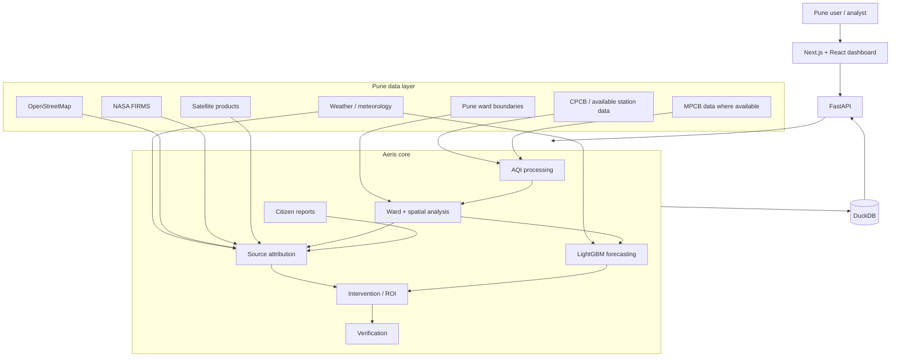

# Aeris — Pune Urban Air Intelligence

**Aeris** is a Pune-focused air-quality intelligence platform that combines ground observations, meteorology, geospatial analysis, forecasting, satellite/fire evidence, source attribution, citizen reports, and intervention planning into one workflow.

> **Scope:** Pune city / Pune Municipal Corporation area.  
> **Prototype:** Aeris is a research and engineering prototype, not an official government monitoring or enforcement system.

## What Aeris does

Aeris turns heterogeneous pollution data into a ward-level operational view:

`MEASURE → MAP → FORECAST → ATTRIBUTE → RECOMMEND → VERIFY`

### 1. Pune ward-level air-quality map

The Command Center divides Pune into its administrative wards and overlays monitoring stations.

For each ward Aeris can display:

- Current PM2.5-derived AQI
- AQI category
- Nearest monitoring station and distance
- Low-confidence marking where a ward is far from available observations
- Ward population and area metadata

Ward values are estimated from available station observations using inverse-distance weighting (IDW). A ward estimate is explicitly different from a directly measured station value.

### 2. Short-term Pune AQI forecasting

Aeris supports 24h, 48h and 72h forecasting using the existing LightGBM quantile-regression pipeline.

The forecasting layer uses:

- Recent PM2.5/PM10/NO2 observations
- Lag and rolling-window features
- Calendar features
- Meteorological variables
- Weather-grid information across Pune

The model can produce p10 / p50 / p90 forecasts rather than only one point estimate.

### 3. Pune pollution-source attribution

For a selected ward, Aeris combines multiple evidence streams to estimate likely contributing source categories.

Possible evidence includes:

- Local monitoring observations
- Wind direction and speed
- Back-trajectory analysis
- Fire detections
- Satellite indicators
- OpenStreetMap industrial / road / land-use context
- Other spatial evidence available for the selected period

The output is an evidence-backed attribution rather than a claim that a single source is certainly responsible.

### 4. Intervention planning

Aeris converts an identified pollution signal into ranked candidate interventions.

Examples include:

- Construction / road-dust controls
- Traffic-related measures
- Open-burning investigations
- Industrial-source review

The existing Gaussian-plume and ROI logic can be used where the necessary source and meteorological inputs exist.

### 5. Citizen pollution reports

Aeris supports citizen-submitted pollution photographs.

Gemini Vision can extract a structured observation such as:

- Outdoor / indoor context
- Haze severity
- Visible smoke
- Possible source category
- Confidence

A citizen report can then be compared against available satellite/fire evidence for the relevant location and date.

Aeris should never invent a numeric AQI from a photograph alone.

### 6. Verification

For interventions that have sufficient historical observations, Aeris can compare pre/post outcomes using the existing verification pipeline.

Where the data is not sufficient for a valid comparison, the system should surface that limitation rather than manufacture an outcome.

---

# System architecture



## Data flow

```text
Pune air-quality observations
          +
Pune ward boundaries
          +
Weather / meteorology
          +
Satellite & fire evidence
          +
OSM / spatial context
          ↓
   Data normalization
          ↓
 Ward + station mapping
          ↓
 ┌────────┼───────────┐
 ↓        ↓           ↓
AQI   Forecasting  Attribution
 ↓        ↓           ↓
 └────────┼───────────┘
          ↓
  Intervention ranking
          ↓
   Verification layer
          ↓
     Aeris dashboard
```

## Pune geographic model

Aeris is designed around a city configuration rather than hard-coded city logic.

The Pune configuration defines:

- Pune bounding box
- Map center / zoom
- Administrative ward boundary source
- Ward ID / name fields
- Weather grid
- Airshed grid used for trajectories
- Population metadata
- Pune-specific data-source mappings

Pune and Pimpri-Chinchwad should be treated as separate municipal scopes unless the project explicitly defines a wider metropolitan study area.

---

# Pune data required

## Real data

| Data | Purpose |
|---|---|
| CPCB / available Pune station observations | Current and historical air quality |
| MPCB monitoring data | Maharashtra-specific monitoring coverage |
| Monitoring-station metadata | Coordinates, station IDs and pollutants |
| Pune ward boundaries | Ward-level map and spatial aggregation |
| Weather observations / forecasts | Forecasting and dispersion / trajectory inputs |
| Satellite products | Regional pollution indicators |
| NASA FIRMS detections | Open-fire evidence |
| OpenStreetMap | Roads, industrial land use, schools and hospitals |
| Pune emission inventory / source-apportionment studies | Local source context and calibration |

## Estimated data

These are **model-derived estimates**, not direct measurements:

- Ward-level AQI between monitoring stations
- Spatially interpolated PM2.5
- Forecast values
- Source-attribution percentages
- Predicted intervention impact

## Synthetic data

Synthetic data may be used for development and UI testing where real values are unavailable, but it must be labeled as synthetic/demo data.

Examples:

- Synthetic ward time series
- Synthetic station observations
- Mock construction-compliance records
- Hypothetical intervention scenarios
- Mock citizen reports

---

# Algorithms

## AQI

Aeris uses pollutant-to-AQI conversion functions and keeps missing observations distinct from a genuine zero reading.

## Spatial interpolation

Ward-level pollution estimates use inverse-distance weighting (IDW) over available station observations.

## Forecasting

The forecasting pipeline uses LightGBM quantile regression for multiple horizons and quantiles.

## Source attribution

The attribution layer combines independent evidence rather than relying on a single signal.

Relevant components include:

- Wind-aware back trajectories
- Evidence scoring / fusion
- Satellite indicators
- Fire detections
- Spatial land-use context

## Dispersion

The intervention pipeline contains a Gaussian-plume model for estimating dispersion effects under specified assumptions.

## Verification

The verification pipeline uses difference-in-differences where the available time series and comparison assumptions support it.

## Computer vision / multimodal AI

Gemini Vision is used for structured analysis of citizen-submitted pollution photographs.

---

# Technology stack

| Frontend | Backend | Data / ML | External data |
|---|---|---|---|
| Next.js | FastAPI | DuckDB | CPCB / MPCB |
| React | Uvicorn | LightGBM | Open-Meteo |
| TypeScript | Pydantic | PyTorch (offline models) | NASA FIRMS |
| Tailwind CSS | REST APIs | scikit-learn | Sentinel-5P / satellite products |
| MapLibre GL | SSE audit stream | NumPy / Pandas | OpenStreetMap |
| TanStack Query | | | |

---

# Project structure

```text
final_year_project/
├── apps/web/                     # Pune dashboard
│   ├── src/app/
│   ├── src/components/
│   └── src/lib/
│
├── services/
│   ├── api/                      # FastAPI API
│   └── pipeline/                 # Data ingestion
│
├── vayu_core/                    # Existing core package; can be renamed later
│   ├── aqi.py
│   ├── geo.py
│   ├── forecast/
│   ├── attribution/
│   ├── national/
│   ├── citizen/
│   ├── google_ai/
│   ├── interventions/
│   └── verification/
│
├── config/
│   └── cities/
│       └── pune.json             # Pune city configuration
│
├── data/
│   └── samples/                  # Cached / demo datasets
│
├── scripts/
├── tests/
└── README.md
```

> The internal Python package directory may remain named `vayu_core` until a code-level rename is performed. The public project name is Aeris.

---

# Getting started

## Prerequisites

- Python 3.11+
- Node.js 20+

## Clone

```bash
git clone https://github.com/ashoka0402/final_year_project.git
cd final_year_project
```

## Environment

```bash
cp .env.example .env
```

API keys are optional for the basic local/demo workflow. Configure the keys for the data sources and AI services you actually use.

## Seed

```bash
make seed
```

## Run

```bash
make dev
```

Then open:

```text
http://localhost:3000
```

---

# Environment variables

The existing `.env.example` contains the project integrations.

Typical variables include:

| Variable | Purpose |
|---|---|
| `DEMO_MODE` | Demo vs live/cached behaviour |
| `DATA_GOV_IN_API_KEY` | CPCB / data.gov.in access |
| `OPENAQ_API_KEY` | OpenAQ measurements |
| `FIRMS_API_KEY` | NASA FIRMS |
| `GOOGLE_API_KEY` | Gemini |
| `GOOGLE_CLOUD_PROJECT` | Optional Vertex path |
| `GEE_SERVICE_ACCOUNT_JSON` | Google Earth Engine |
| `NEXT_PUBLIC_MAPPLS_KEY` | Optional India basemap |
| `VAYU_DB_PATH` | DuckDB location |

For an Aeris-only Pune deployment, unused Delhi/NCR/Lucknow-specific settings and documentation should be removed or marked inactive.

---

# API

The city API remains city-config driven.

Representative endpoints:

| Endpoint | Purpose |
|---|---|
| `GET /api/v1/cities` | Pune city catalogue |
| `GET /api/v1/cities/pune/current` | Current Pune conditions |
| `GET /api/v1/cities/pune/wards.geojson` | Pune ward geometry |
| `GET /api/v1/cities/pune/forecast?h=24` | Pune forecast |
| `GET /api/v1/cities/pune/attribution/{ward_id}` | Ward attribution |
| `GET /api/v1/cities/pune/trajectory/{ward_id}` | Back trajectory |
| `GET /api/v1/cities/pune/interventions` | Ranked interventions |
| `GET /api/v1/cities/pune/citizen/{ward_id}` | Citizen-facing ward view |

---

# Testing

```bash
make test
make lint
```

The existing suite covers core components including AQI, ward geometry, spatial interpolation, forecasting, attribution, trajectories, Gaussian plume calculations, ROI ranking, citizen corroboration, verification, and API behaviour.

Pune-specific integration tests should additionally verify:

- Pune boundary loading
- Pune station ingestion
- Pune ward IDs / names
- Pune map center and extent
- Pune-specific data filtering
- No accidental Delhi/Lucknow fallback

---

# Current scope and limitations

Aeris is a Pune adaptation of a previously multi-city prototype. The existing repository contains historical Delhi, Delhi-NCR and Lucknow assets; those should not be described as Pune observations.

The Pune version should distinguish three classes of data:

**Measured** — directly obtained from monitoring / external sources.

**Estimated** — produced by interpolation or models from real inputs.

**Synthetic / demo** — generated only for development, UI testing, or scenarios.

The distinction should be visible in both the API and UI.

A forecast is not a measurement. A ward value produced by IDW is not a monitoring-station reading. A citizen photograph does not establish a numeric AQI. An intervention-impact estimate is not a verified outcome.

---

# Roadmap

### Phase 1 — Pune foundation

- Add `config/cities/pune.json`
- Add Pune ward boundary dataset
- Add Pune monitoring-station registry
- Connect Pune air-quality history
- Update map center / extent

### Phase 2 — Pune intelligence

- Pune weather archive
- Pune forecast training / calibration
- Pune source-attribution calibration
- Pune fire / satellite evidence
- Pune-specific intervention categories

### Phase 3 — Pune product

- Pune-only dashboard
- Ward selector
- Station overlay
- Forecast panel
- Source attribution panel
- Citizen reporting
- Verification dashboard

### Phase 4 — validation

- Pune holdout evaluation
- Baseline comparison
- Data-coverage diagnostics
- Measured vs estimated vs synthetic labels
- Reproducible evaluation artifacts

---

# Project positioning

**Aeris is not just a renamed VAYU dashboard.**

The intended Pune version preserves the reusable engineering and modelling components while replacing the geography, data sources, city configuration, historical datasets, and locally relevant interpretation with Pune-specific inputs.

That makes Pune the actual study area rather than a Delhi dashboard displayed over a Pune map.

---

## License

No license file is currently published in this repository. Treat the repository as all-rights-reserved unless a license is added.

> **Prototype. Not an official government system.** Air-quality values and model outputs should be interpreted according to their provenance and confidence.
